# Audio Listener AI - Software Analysis and Design Document

<div align="center">
  
  <p><em>Figure 1: Audio Listener AI System Overview</em></p>
</div>

## Table of Contents

1. [Executive Summary](#1-executive-summary)
2. [System Overview](#2-system-overview)
   - [Purpose and Scope](#21-purpose-and-scope)
   - [Key Features](#22-key-features)
3. [System Architecture](#3-system-architecture)
   - [High-Level Architecture](#31-high-level-architecture)
   - [Component Diagram](#32-component-diagram)
   - [Data Flow](#33-data-flow)
4. [Backend Components](#4-backend-components)
   - [Server Core](#41-server-core)
   - [Controllers](#42-controllers)
   - [Routes](#43-routes)
   - [Utilities](#44-utilities)
   - [External Service Integration](#45-external-service-integration)
5. [Frontend Components](#5-frontend-components)
   - [Shared Components](#51-shared-components-all-platforms)
   - [Web Application](#52-web-application)
   - [Desktop Application](#53-desktop-application-electron)
   - [Mobile Application](#54-mobile-application-react-nativeexpo)
   - [Chrome Extension](#55-chrome-extension)
6. [Data Models](#6-data-models)
7. [Communication Protocols](#7-communication-protocols)
8. [User Interface Design](#8-user-interface-design)
9. [Error Handling and Recovery](#9-error-handling-and-recovery)
10. [Security Considerations](#10-security-considerations)
11. [Performance Considerations](#11-performance-considerations)
12. [Testing Strategy](#12-testing-strategy)
13. [Deployment Strategy](#13-deployment-strategy)
14. [Future Enhancements](#14-future-enhancements)
15. [Development Guidelines](#15-development-guidelines)
16. [Conclusion](#16-conclusion)

## 1. Executive Summary

Audio Listener AI is a multi-platform application that allows users to record audio questions, process them using speech-to-text technology, and receive AI-generated answers. The system supports multiple platforms including web, desktop (Electron), mobile (React Native), and Chrome extension. It uses AssemblyAI for speech-to-text conversion and Google's Gemini AI for generating responses.

This document provides a comprehensive analysis of the system architecture, components, data flow, and design patterns to guide development and maintenance.

> **Note**: All diagrams in this document are available as high-quality SVG files in the `diagrams/images` folder. For the best viewing experience, use a PDF viewer or web browser that supports SVG rendering.

## 2. System Overview

### 2.1 Purpose and Scope

The Audio Listener AI system is designed to:

- Record audio from various input sources (microphone, system audio)
- Convert speech to text using AssemblyAI
- Process the text with Google's Gemini AI to generate responses
- Support multiple languages and contexts
- Maintain a history of interactions
- Provide a consistent user experience across platforms

### 2.2 Key Features

- **Audio Recording**: Capture audio from microphone or system audio (desktop only)
- **Speech-to-Text**: Convert audio to text using AssemblyAI
- **AI Processing**: Generate responses using Google's Gemini AI
- **Multi-platform Support**: Web, Desktop, Mobile, and Chrome Extension
- **Real-time Communication**: Stream responses as they're generated
- **History Management**: Save and retrieve past interactions
- **Language Support**: Multiple languages including English and Vietnamese
- **Context-aware Processing**: Customize AI responses based on context
- **Follow-up Questions**: Ask follow-up questions with context from previous interactions

## 3. System Architecture

### 3.1 High-Level Architecture

The system follows a client-server architecture with the following components:

1. **Backend Server**:

   - Node.js/Express server
   - RESTful API endpoints
   - Socket.IO for real-time communication
   - Integration with external services (AssemblyAI, Google Gemini)

2. **Frontend Clients**:

   - Web Application (HTML/CSS/JavaScript)
   - Desktop Application (Electron/TypeScript)
   - Mobile Application (React Native/Expo)
   - Chrome Extension

3. **External Services**:
   - AssemblyAI for speech-to-text
   - Google Gemini AI for text processing

### 3.2 Component Diagram

<div align="center">
  
  <p><em>Figure 2: Detailed Platform Component Diagram</em></p>
</div>

The diagram above illustrates the relationships between different components across all platforms. The system follows a client-server architecture where:

- Multiple client applications (Web, Desktop, Mobile, Chrome Extension) connect to the same backend server
- The backend server integrates with external services (AssemblyAI and Google Gemini AI)
- Each client platform implements platform-specific features while sharing common communication protocols

### 3.3 Data Flow

1. **Recording Flow**:

   - Client records audio (microphone/system audio)
   - Audio is sent to the backend server
   - Backend processes and stores the audio file
   - Backend sends confirmation to client

2. **Transcription Flow**:

   - Backend sends audio to AssemblyAI
   - AssemblyAI returns transcribed text
   - Backend sends transcript to client
   - Backend stores transcript for potential follow-up

3. **AI Processing Flow**:

   - Backend sends transcript to Google Gemini AI
   - Gemini processes the text and generates a response
   - Backend streams the response to client in real-time
   - Backend stores the complete interaction in history

4. **Direct Gemini Processing Flow**:
   - Client sends audio directly for Gemini processing
   - Backend sends audio to Gemini AI (bypassing transcription)
   - Gemini processes audio and generates response
   - Backend streams response to client

<div align="center">
  
  <p><em>Figure 3: Comprehensive Data Flow Diagram</em></p>
</div>

The diagram above illustrates how data moves through the system, including the alternative flow for direct Gemini processing.

#### Key Sequence Diagrams

<div align="center">
  
  <p><em>Figure 4: Recording and Processing Sequence</em></p>
</div>

<div align="center">
  
  <p><em>Figure 5: Retry Transcription Sequence</em></p>
</div>

<div align="center">
  
  <p><em>Figure 6: Direct Gemini Processing Sequence</em></p>
</div>

## 4. Backend Components

### 4.1 Server Core

- **Express Server**: Handles HTTP requests and serves static files
- **Socket.IO Server**: Manages real-time communication with clients
- **Event System**: Bridges backend events to Socket.IO

### 4.2 Controllers

- **Recording Controller**: Manages audio recording and file uploads
- **Transcription Controller**: Handles speech-to-text processing
- **AI Processing Controller**: Manages Gemini AI integration
- **Processing Controller**: Handles cancellation and state management
- **File Controller**: Manages audio file validation and conversion
- **Base Controller**: Provides shared state and utility functions

### 4.3 Routes

- **/api/v1/recording**: API endpoints for recording operations
  - POST /start: Start recording session
  - POST /upload: Upload audio file
  - POST /stop: Stop recording and process audio
  - POST /retry: Retry transcription with different settings
  - POST /retry-upload: Upload and retry transcription
  - POST /gemini: Process with Gemini AI
  - POST /gemini-upload: Upload and process with Gemini
  - POST /stream: Stream AI response
  - POST /cancel: Cancel ongoing processing

### 4.4 Utilities

- **Audio Processor**: Handles audio file processing and transcription
- **AI Utilities**: Manages AI client initialization and processing
- **FFmpeg Utilities**: Handles audio format conversion and cleanup
- **Logger**: Provides timestamped logging
- **Try-Catch Wrapper**: Standardizes error handling

### 4.5 External Service Integration

- **AssemblyAI Client**: Handles speech-to-text conversion
- **Google Gemini AI Client**: Processes text and generates responses

<div align="center">
  
  <p><em>Figure 7: Backend Class Diagram</em></p>
</div>

The diagram above shows the main backend components of the Audio Listener AI system, including their relationships, key methods, and properties. The architecture follows a modular design with clear separation of concerns between controllers, utilities, and external service integrations.

## 5. Frontend Components

### 5.1 Shared Components (All Platforms)

- **Audio Controls**: Manages recording, retry, and Gemini processing
- **Socket Handlers**: Manages Socket.IO events and updates
- **Animation**: Handles text animations and streaming content display
- **History Manager**: Manages interaction history
- **Markdown Rendering**: Formats AI responses with markdown

### 5.2 Web Application

- **HTML/CSS/JavaScript**: Standard web technologies
- **Module Structure**: Modular JavaScript files
- **Socket.IO Client**: Real-time communication with server

### 5.3 Desktop Application (Electron)

- **Main Process**: Electron main process (main.ts)
- **Renderer Process**: UI components and user interaction
- **Preload Script**: Secure bridge between main and renderer
- **Audio Device Manager**: Manages audio input devices
- **Audio Recorder**: Handles audio recording with MediaRecorder API
- **System Audio Capture**: Captures system audio using Electron's desktopCapturer

### 5.4 Mobile Application (React Native/Expo)

- **React Native Components**: UI components for mobile
- **Expo Audio**: Audio recording and playback
- **Custom Hooks**: React hooks for audio, socket, and state management
- **API Service**: Communication with backend server
- **Socket Service**: Real-time communication with Socket.IO
- **AsyncStorage**: Local storage for settings and history

### 5.5 Chrome Extension

- **Popup UI**: Extension popup interface
- **Background Script**: Manages extension state and communication
- **Content Scripts**: Interact with web pages
- **Audio Recorder**: Records audio in the browser context
- **Socket.IO Client**: Real-time communication with server

<div align="center">
  
  <p><em>Figure 8: Frontend Class Diagram</em></p>
</div>

The diagram above illustrates the frontend components across different platforms, showing both shared components and platform-specific implementations. This architecture allows for code reuse while leveraging the unique capabilities of each platform.

## 6. Data Models

### 6.1 Audio Recording

```javascript
{
  audioFile: String,       // Path to audio file
  format: String,          // Audio format (wav, mp3, etc.)
  duration: Number,        // Duration in seconds
  timestamp: Date          // Recording timestamp
}
```

### 6.2 Transcription

```javascript
{
  transcript: String,      // Transcribed text
  language: String,        // Language code (en, vi, etc.)
  confidence: Number,      // Confidence score (0-1)
  audioFile: String,       // Reference to audio file
  timestamp: Date          // Transcription timestamp
}
```

### 6.3 AI Response

```javascript
{
  question: String,        // Original question (transcript)
  answer: String,          // AI-generated answer
  language: String,        // Language code
  context: String,         // Question context
  isFollowUp: Boolean,     // Whether it's a follow-up question
  timestamp: Date          // Response timestamp
}
```

### 6.4 History Item

```javascript
{
  id: String,              // Unique identifier
  question: String,        // Original question
  answer: String,          // AI-generated answer
  language: String,        // Language code
  context: String,         // Question context
  timestamp: Date,         // Interaction timestamp
  audioFile: String        // Reference to audio file (optional)
}
```

## 7. Communication Protocols

### 7.1 RESTful API

The backend exposes RESTful API endpoints for:

- Starting/stopping recording
- Uploading audio files
- Processing with AssemblyAI and Gemini
- Retrieving history
- Managing application state

### 7.2 Socket.IO Events

Real-time communication uses Socket.IO with the following events:

**Server to Client:**

- `processing`: Notifies client that processing has started
- `transcript`: Sends transcription result
- `update`: Sends partial or complete answer
- `streamChunk`: Sends a chunk of the streaming response
- `streamEnd`: Signals the end of streaming
- `streamError`: Notifies of streaming error
- `error`: Sends error information
- `processingCancelled`: Notifies that processing was cancelled

**Client to Server:**

- `startRecording`: Starts recording session
- `stopRecording`: Stops recording and processes audio
- `retryTranscription`: Retries transcription with different settings
- `processWithGemini`: Processes audio directly with Gemini
- `cancelProcessing`: Cancels ongoing processing

### 7.3 File Transfer

Audio files are transferred using:

- HTTP POST with multipart/form-data for file uploads
- Base64 encoding for smaller audio chunks

## 8. User Interface Design

### 8.1 Common UI Elements

All platforms share these core UI elements:

- Recording controls (Start/Stop button)
- Retry and Gemini processing buttons
- Cancel button
- Question display area
- Answer display area with markdown rendering
- Language selection
- Context selection
- Follow-up question checkbox
- Loading indicators

### 8.2 Platform-Specific UI

**Web Application:**

- Full-page layout
- History sidebar
- Responsive design for desktop and mobile browsers

**Desktop Application:**

- Native window with menu bar
- Audio device selection dropdown
- Audio source selection (microphone/system audio)
- Debug information panel

**Mobile Application:**

- Native mobile UI components
- Touch-optimized controls
- Platform-specific audio permissions
- Simplified history view

**Chrome Extension:**

- Compact popup interface
- Limited history display
- Quick access controls

## 9. Error Handling and Recovery

### 9.1 Error Types

- **Network Errors**: Connection issues with server or external services
- **Permission Errors**: Microphone access denied
- **Processing Errors**: Failed transcription or AI processing
- **File Errors**: Invalid audio files or format issues
- **API Errors**: External service API failures

### 9.2 Error Handling Strategy

- **Client-side**: Display user-friendly error messages
- **Server-side**: Log detailed errors and return appropriate status codes
- **Retry Mechanism**: Automatic retry for transcription with different models
- **Graceful Degradation**: Fall back to alternative methods when possible
- **Error Events**: Broadcast errors via Socket.IO for real-time notification

<div align="center">
  
  <p><em>Figure 9: Application State Diagram</em></p>
</div>

The diagram above illustrates the different states of the Audio Listener AI application and the transitions between them based on user actions and system events. Understanding these state transitions is crucial for implementing proper error handling and recovery mechanisms.

## 10. Security Considerations

### 10.1 API Keys

- Store API keys in environment variables (.env file)
- Never expose API keys in client-side code

### 10.2 Data Protection

- Clean up temporary audio files after processing
- Implement proper CORS policies
- Use secure WebSocket connections

### 10.3 Permissions

- Request minimum required permissions
- Handle permission denials gracefully
- Provide clear explanations for permission requests

## 11. Performance Considerations

### 11.1 Audio Processing

- Optimize audio file size for network transfer
- Use appropriate sample rates (16000Hz standard)
- Clean up audio files to prevent disk space issues

### 11.2 Real-time Communication

- Use efficient Socket.IO transport mechanisms
- Implement reconnection strategies
- Optimize streaming chunk size

### 11.3 UI Responsiveness

- Use non-blocking operations for audio recording
- Implement smooth animations for streaming text
- Provide clear loading indicators

## 12. Testing Strategy

### 12.1 Unit Testing

- Test individual components and utilities
- Mock external services for consistent testing
- Test error handling and edge cases

### 12.2 Integration Testing

- Test communication between frontend and backend
- Test external service integration
- Test cross-platform compatibility

### 12.3 End-to-End Testing

- Test complete user flows
- Test on different devices and platforms
- Test with various audio inputs and languages

## 13. Deployment Strategy

### 13.1 Backend Deployment

- Node.js server on cloud platform (AWS, GCP, etc.)
- Environment-specific configuration
- Proper logging and monitoring

### 13.2 Frontend Deployment

- Web: Static hosting with CDN
- Desktop: Electron packaging for Windows/Mac/Linux
- Mobile: App store distribution
- Chrome Extension: Chrome Web Store

<div align="center">
  
  <p><em>Figure 10: Deployment Diagram</em></p>
</div>

The diagram above illustrates how the Audio Listener AI system would be deployed in a production environment. It shows the deployment of backend components on a cloud platform, the distribution of client applications through appropriate channels, and the integration with external services.

## 14. Future Enhancements

### 14.1 Technical Improvements

- Implement user authentication and accounts
- Add support for more languages
- Improve audio quality detection and enhancement
- Implement offline mode for basic functionality
- Add support for video input

### 14.2 Feature Enhancements

- Custom AI model fine-tuning
- Voice response (text-to-speech)
- Advanced context management
- Integration with other AI services
- Collaborative features for team use

## 15. Development Guidelines

### 15.1 Code Organization

- Follow modular architecture
- Maintain separation of concerns
- Use consistent naming conventions
- Document code with comments

### 15.2 Version Control

- Use Git for version control
- Follow feature branch workflow
- Write meaningful commit messages
- Maintain a clean commit history

### 15.3 Documentation

- Maintain up-to-date README files
- Document API endpoints
- Create user guides for each platform
- Update this design document as the system evolves

## 16. Conclusion

The Audio Listener AI system provides a powerful and flexible solution for audio-based AI interaction across multiple platforms. This design document serves as a comprehensive guide for understanding the system architecture, components, and design decisions.

By following this design, developers can maintain consistency across platforms while leveraging the unique capabilities of each environment to provide the best possible user experience.

## List of Figures

1. Figure 1: Audio Listener AI System Overview
2. Figure 2: Detailed Platform Component Diagram
3. Figure 3: Comprehensive Data Flow Diagram
4. Figure 4: Recording and Processing Sequence
5. Figure 5: Retry Transcription Sequence
6. Figure 6: Direct Gemini Processing Sequence
7. Figure 7: Backend Class Diagram
8. Figure 8: Frontend Class Diagram
9. Figure 9: Application State Diagram
10. Figure 10: Deployment Diagram
