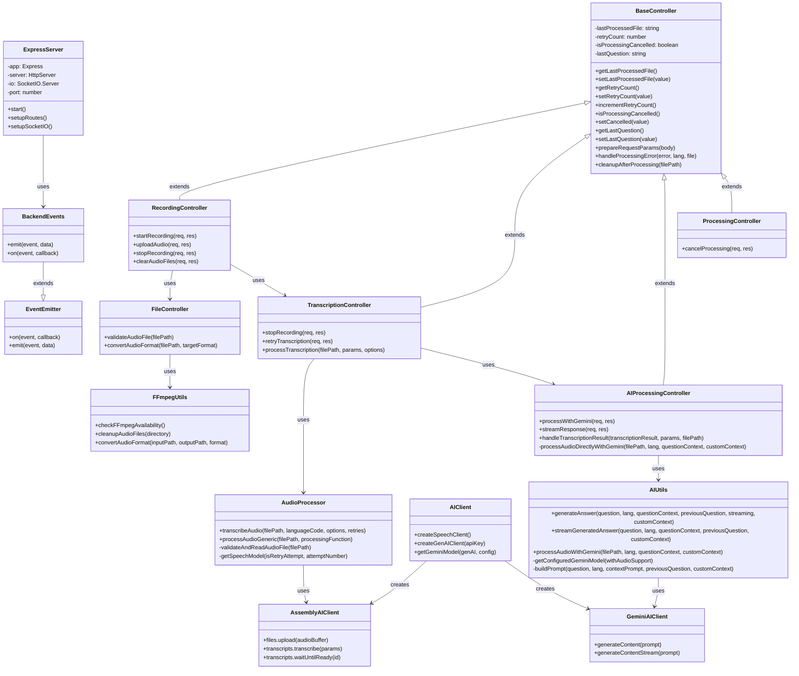

# Backend Class Diagram

This class diagram shows the main backend components of the Audio Listener AI system, including:

1. **Core Server Classes**: ExpressServer, EventEmitter, and BackendEvents for handling HTTP requests and real-time communication
2. **Controller Classes**: BaseController and its specialized extensions for handling different aspects of the application
3. **Utility Classes**: AudioProcessor, AIUtils, and FFmpegUtils for handling specific functionality
4. **External Service Clients**: AssemblyAIClient for speech-to-text and GeminiAIClient for AI processing

Key features illustrated in the diagram:

- Inheritance relationships between BaseController and specialized controllers
- Clear separation of concerns between different components
- Integration with external services (AssemblyAI and Google Gemini)
- Speech model selection logic in AudioProcessor
- Audio file validation and conversion in FileController
- Event-based communication through BackendEvents
