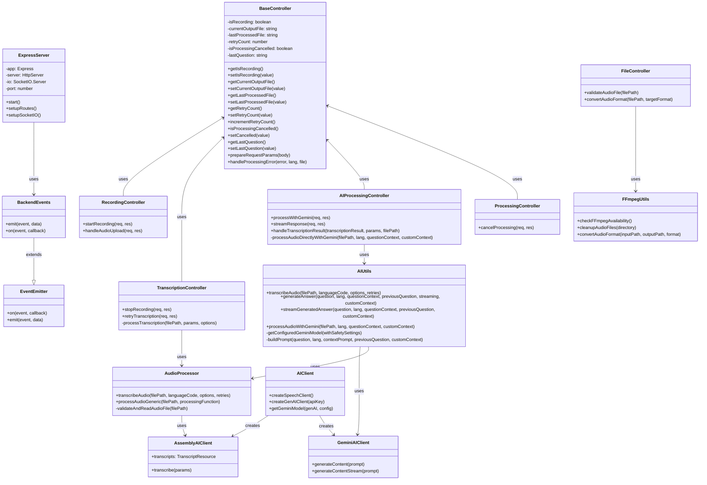

# Backend Class Diagram

This class diagram shows the main backend components of the Audio Listener AI system, including:

1. Core server classes
2. Controller classes
3. Utility classes
4. External service clients

The diagram illustrates the relationships between these components and their key methods and properties.
