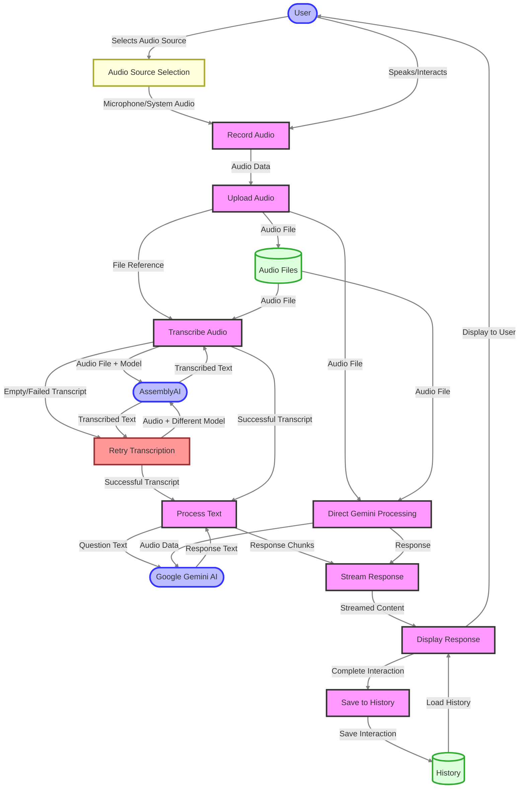

# Data Flow Diagram

This data flow diagram illustrates how data moves through the Audio Listener AI system:

1. User selects audio source (microphone or system audio on desktop)
2. User interacts with the system to record audio
3. Audio data is uploaded to the server
4. Audio is transcribed using AssemblyAI with appropriate speech model
5. If transcription fails or returns empty, retry with different speech models:
   - First retry: Best model (higher quality)
   - Second retry: Nano model (lightweight)
   - Third retry: Universal model with different settings
6. Successful transcript is processed with Google Gemini AI
7. Response is streamed back to the client in real-time
8. Response is displayed to the user with markdown formatting
9. Complete interaction is saved to history

The diagram also shows the alternative flow for direct Gemini processing, where audio is sent directly to Gemini AI, bypassing the separate transcription step. This provides a fallback method when transcription is challenging.
