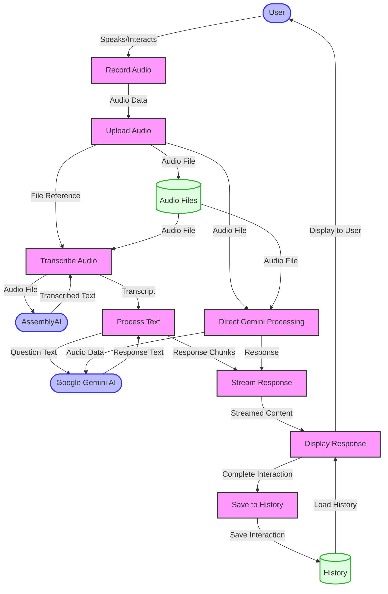

# Data Flow Diagram

This data flow diagram illustrates how data moves through the Audio Listener AI system:

1. User interacts with the system to record audio
2. Audio data is uploaded to the server
3. Audio is transcribed using AssemblyAI
4. Transcript is processed with Google Gemini AI
5. Response is streamed back to the client
6. Response is displayed to the user
7. Interaction is saved to history

The diagram also shows the alternative flow for direct Gemini processing, where audio is sent directly to Gemini AI, bypassing the separate transcription step.
