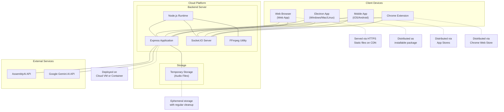

# Deployment Diagram

This deployment diagram illustrates how the Audio Listener AI system would be deployed in a production environment:

1. Backend Server components deployed on a cloud platform
2. External Services (AssemblyAI and Google Gemini AI) accessed via APIs
3. Client applications distributed through appropriate channels
4. Communication between clients and server via HTTP/HTTPS and WebSockets

The diagram includes deployment notes for each component, indicating how they would be deployed and distributed.
