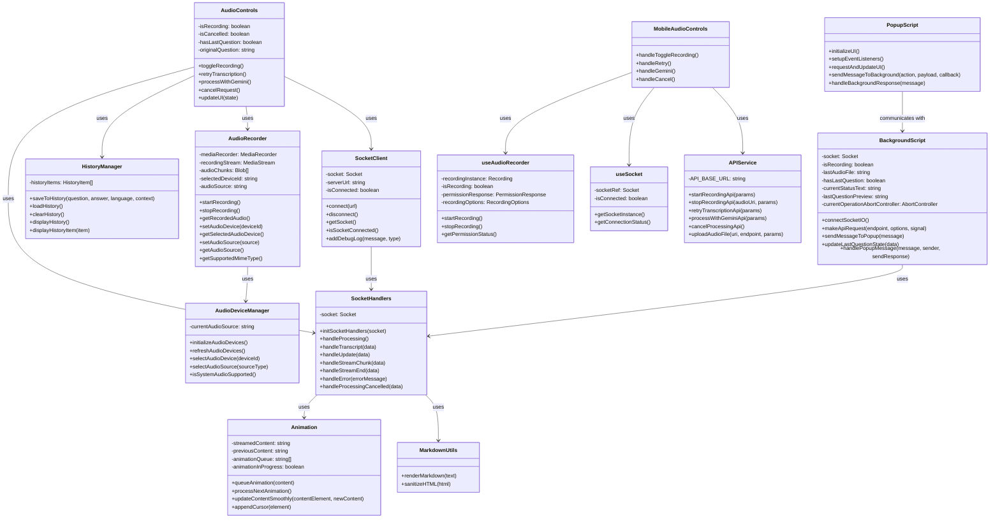

# Frontend Class Diagram

This class diagram illustrates the frontend components of the Audio Listener AI system across different platforms:

1. Shared components used across all platforms
2. Desktop application (Electron) specific components
3. Mobile application (React Native) specific components
4. Chrome extension specific components

The diagram shows the relationships between these components and their key methods and properties.
