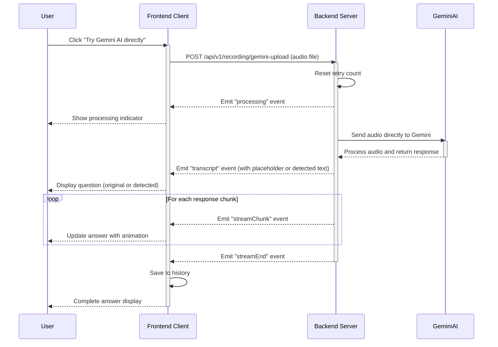

# Direct Gemini Processing Sequence Diagram

This sequence diagram illustrates the direct Gemini processing flow in the Audio Listener AI system:

1. User initiates direct Gemini processing
2. Client sends audio to server for Gemini processing
3. Server sends audio directly to Gemini AI (bypassing AssemblyAI)
4. Gemini processes the audio and generates a response
5. Server streams the response back to client
6. Client displays the response to user

The diagram shows how the system can bypass the separate transcription step and send audio directly to Gemini for processing, which may be useful in cases where the transcription service is struggling with certain audio inputs.
