# Platform Component Diagram

```mermaid
graph TB
    %% Define styles for better visibility
    classDef backend fill:#d9f0ff,stroke:#0078d7,stroke-width:2px;
    classDef external fill:#ffe6cc,stroke:#d79b00,stroke-width:2px;
    classDef web fill:#d5e8d4,stroke:#82b366,stroke-width:2px;
    classDef desktop fill:#e1d5e7,stroke:#9673a6,stroke-width:2px;
    classDef mobile fill:#fff2cc,stroke:#d6b656,stroke-width:2px;
    classDef extension fill:#f8cecc,stroke:#b85450,stroke-width:2px;

    subgraph "External Services"
        AssemblyAI["AssemblyAI\n(Speech-to-Text)"]
        GeminiAI["Google Gemini AI\n(Text Processing)"]
    end

    subgraph "Web Application"
        WebUI["Web UI\n(HTML/CSS/JS)"]
        WebSocketClient["Socket.IO Client"]
        WebAudioRecorder["Audio Recorder"]
        WebHistory["History Manager"]
        WebMarkdown["Markdown Renderer"]
    end

    subgraph "Desktop Application"
        ElectronMain["Electron Main Process"]
        ElectronRenderer["Electron Renderer"]
        DesktopUI["Desktop UI"]
        DesktopSocketClient["Socket.IO Client"]
        DesktopAudioRecorder["Audio Recorder"]
        DesktopAudioDeviceManager["Audio Device Manager"]
        SystemAudioCapture["System Audio Capture"]
        AudioSourceSelector["Audio Source Selector"]
        DesktopMarkdown["Markdown Renderer"]
    end

    subgraph "Mobile Application"
        ReactNative["React Native App"]
        MobileUI["Mobile UI Components"]
        ExpoAudio["Expo Audio"]
        MobileSocketClient["Socket.IO Client"]
        MobileAPIService["API Service"]
        AsyncStorage["AsyncStorage"]
        MobileMarkdown["Markdown Renderer"]
    end

    subgraph "Chrome Extension"
        ExtensionPopup["Extension Popup"]
        BackgroundScript["Background Script"]
        ExtensionSocketClient["Socket.IO Client"]
        ExtensionAudioRecorder["Audio Recorder"]
        PermissionHandler["Permission Handler"]
    end

    subgraph "Backend Server"
        Express["Express Server"]
        SocketIO["Socket.IO Server"]
        APIRoutes["API Routes"]
        Controllers["Controllers"]
        AudioProcessing["Audio Processing"]
        SpeechModels["Speech Model Selection"]
        AIIntegration["AI Integration"]
        FileManagement["File Management"]
    end

    %% Backend connections with thicker lines
    Express ===o SocketIO
    Express ===o APIRoutes
    APIRoutes ===o Controllers
    Controllers ===o AudioProcessing
    Controllers ===o AIIntegration
    Controllers ===o FileManagement
    AudioProcessing ===o SpeechModels

    %% External service connections
    AudioProcessing ===o AssemblyAI
    SpeechModels ---o AssemblyAI
    AIIntegration ===o GeminiAI

    %% Web app connections
    WebUI ===o WebSocketClient
    WebUI ===o WebAudioRecorder
    WebUI ===o WebHistory
    WebUI ===o WebMarkdown
    WebSocketClient ---o SocketIO

    %% Desktop app connections
    ElectronMain ===o ElectronRenderer
    ElectronRenderer ===o DesktopUI
    DesktopUI ===o DesktopSocketClient
    DesktopUI ===o DesktopAudioRecorder
    DesktopUI ===o DesktopAudioDeviceManager
    DesktopUI ===o AudioSourceSelector
    DesktopUI ===o DesktopMarkdown
    AudioSourceSelector ---o DesktopAudioRecorder
    AudioSourceSelector ---o SystemAudioCapture
    DesktopAudioRecorder ---o SystemAudioCapture
    DesktopSocketClient ---o SocketIO

    %% Mobile app connections
    ReactNative ===o MobileUI
    MobileUI ===o ExpoAudio
    MobileUI ===o MobileSocketClient
    MobileUI ===o MobileAPIService
    MobileUI ===o AsyncStorage
    MobileUI ===o MobileMarkdown
    MobileSocketClient ---o SocketIO
    MobileAPIService ---o APIRoutes

    %% Chrome extension connections
    ExtensionPopup ===o BackgroundScript
    BackgroundScript ===o ExtensionSocketClient
    BackgroundScript ===o ExtensionAudioRecorder
    BackgroundScript ===o PermissionHandler
    ExtensionSocketClient ---o SocketIO

    %% Apply styles
    class Express,SocketIO,APIRoutes,Controllers,AudioProcessing,SpeechModels,AIIntegration,FileManagement backend;
    class AssemblyAI,GeminiAI external;
    class WebUI,WebSocketClient,WebAudioRecorder,WebHistory,WebMarkdown web;
    class ElectronMain,ElectronRenderer,DesktopUI,DesktopSocketClient,DesktopAudioRecorder,DesktopAudioDeviceManager,SystemAudioCapture,AudioSourceSelector,DesktopMarkdown desktop;
    class ReactNative,MobileUI,ExpoAudio,MobileSocketClient,MobileAPIService,AsyncStorage,MobileMarkdown mobile;
    class ExtensionPopup,BackgroundScript,ExtensionSocketClient,ExtensionAudioRecorder,PermissionHandler extension;
```

This component diagram illustrates the relationships between different platforms in the Audio Listener AI system:

1. **Backend Server Components**:

   - Express Server and Socket.IO for HTTP and real-time communication
   - API Routes for RESTful endpoints
   - Controllers for business logic
   - Audio Processing with Speech Model Selection for transcription
   - AI Integration for Gemini processing
   - File Management for audio file handling

2. **External Services**:

   - AssemblyAI for speech-to-text with multiple model options
   - Google Gemini AI for text processing and response generation

3. **Web Application Components**:

   - Web UI with HTML/CSS/JavaScript
   - Socket.IO Client for real-time updates
   - Audio Recorder for microphone input
   - History Manager for past interactions
   - Markdown Renderer for formatted responses

4. **Desktop Application (Electron) Components**:

   - Electron Main and Renderer processes
   - Audio Source Selector for choosing between microphone and system audio
   - System Audio Capture using desktopCapturer
   - Audio Device Manager for selecting input devices
   - Markdown Renderer matching web implementation

5. **Mobile Application (React Native/Expo) Components**:

   - React Native UI Components
   - Expo Audio with optimized recording settings
   - Platform-specific API Service
   - AsyncStorage for local data persistence
   - Markdown Renderer for consistent display

6. **Chrome Extension Components**:
   - Extension Popup UI
   - Background Script for state management
   - Audio Recorder for browser context
   - Permission Handler for microphone access

The diagram shows how all platforms connect to the same backend server while implementing platform-specific features. Thicker connection lines indicate primary data flows, while colors differentiate between platform components.
