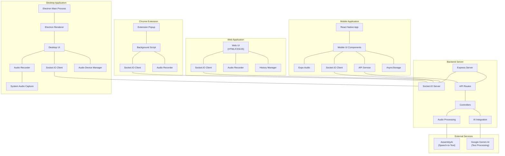

# Platform Component Diagram

This component diagram illustrates the relationships between different platforms in the Audio Listener AI system:

1. Backend Server components
2. External Services
3. Web Application components
4. Desktop Application (Electron) components
5. Mobile Application (React Native) components
6. Chrome Extension components

The diagram shows how all platforms connect to the same backend server while implementing platform-specific features and capabilities.
