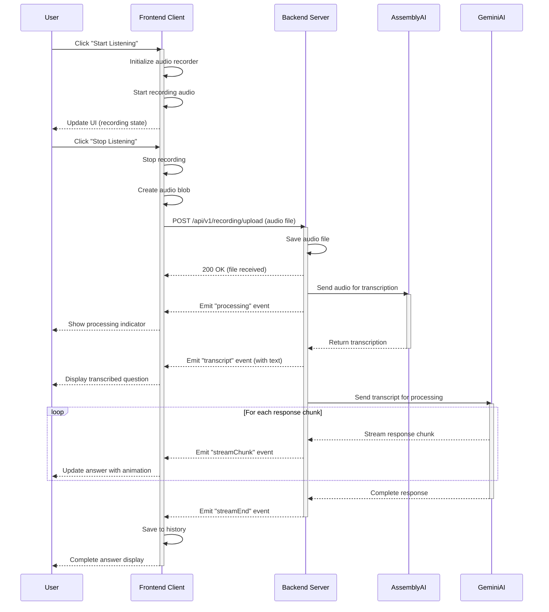

# Audio Recording and Processing Sequence Diagram

This sequence diagram illustrates the main flow of audio recording and processing in the Audio Listener AI system:

1. User initiates recording
2. Client records and sends audio to server
3. Server processes audio with AssemblyAI for transcription
4. Server processes transcript with Gemini AI
5. Server streams response back to client
6. Client displays response to user

The diagram shows the asynchronous nature of the process and the real-time updates provided to the user.
