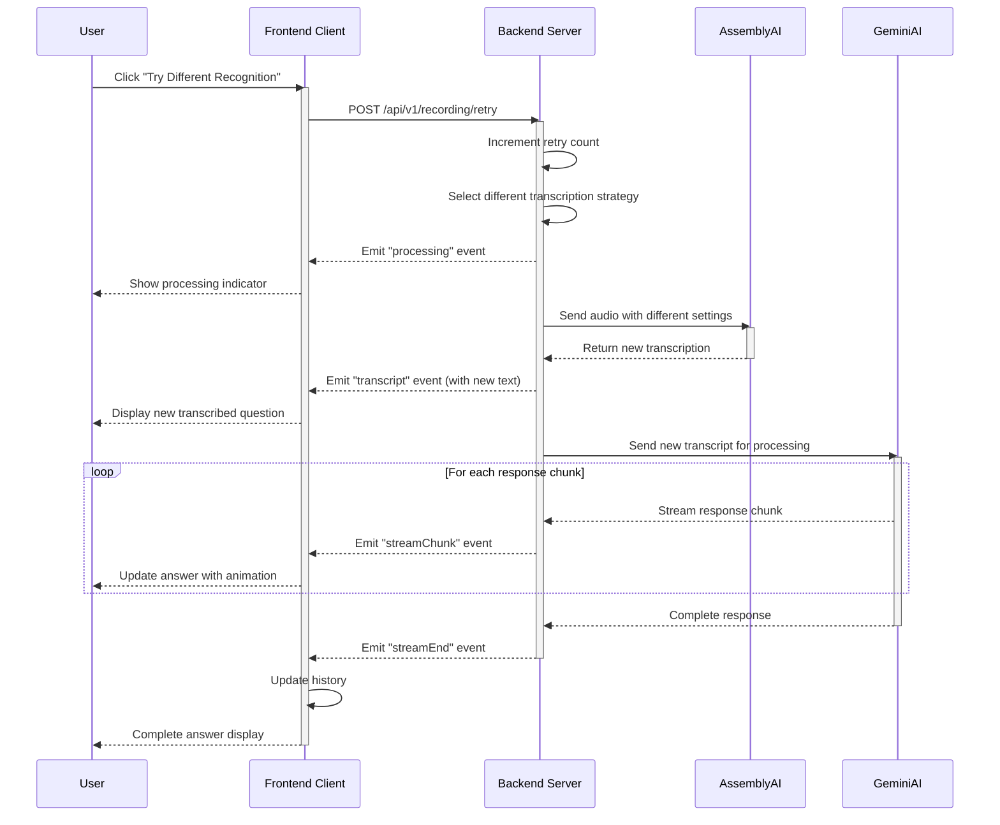

# Retry Transcription Sequence Diagram

This sequence diagram illustrates the retry transcription flow in the Audio Listener AI system:

1. User initiates retry
2. Server selects a different transcription strategy
3. Server reprocesses the audio with AssemblyAI using different settings
4. Server processes the new transcript with Gemini AI
5. Server streams the new response back to client
6. Client displays the new response to user

The diagram shows how the system attempts to improve transcription accuracy by trying different approaches when the initial transcription is unsatisfactory.
