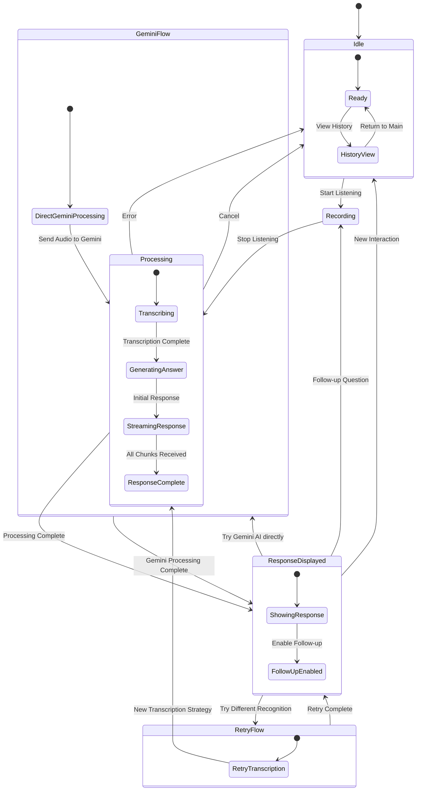

# Application State Diagram

This state diagram illustrates the different states of the Audio Listener AI application:

1. Idle state (Ready or viewing History)
2. Recording state (capturing audio)
3. Processing state (transcribing, generating answer, streaming response)
4. Response Displayed state (showing response, enabling follow-up)
5. Retry Flow (trying different transcription strategy)
6. Gemini Flow (direct Gemini processing)

The diagram shows the transitions between these states based on user actions and system events.
